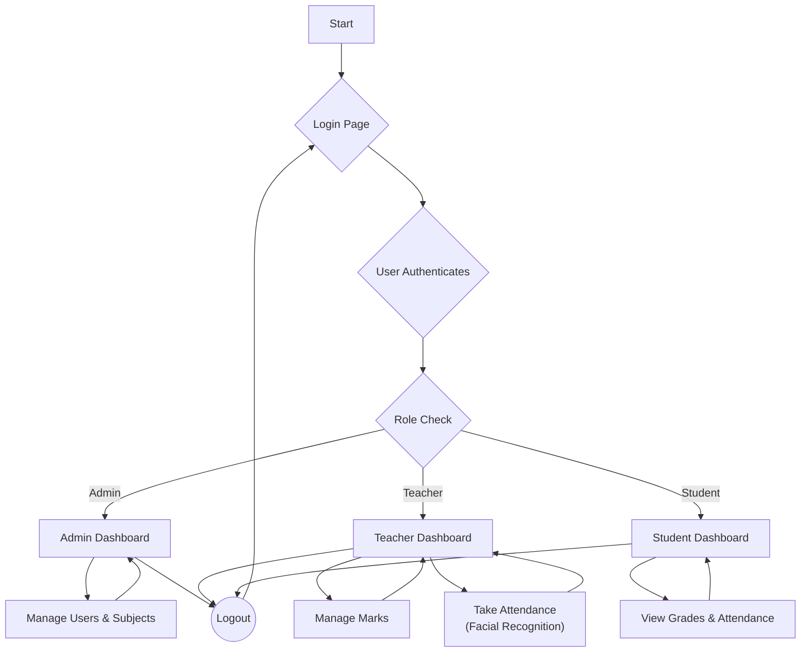

```mermaid
graph TD
    A[Start] --> B{Login Page};
    B --> C{User Authenticates};
    C --> D{Role Check};

    D -- Admin --> E[Admin Dashboard];
    E --> F[Manage Users & Subjects];
    F --> E;

    D -- Teacher --> G[Teacher Dashboard];
    G --> H[Manage Marks];
    H --> G;
    G --> I["Take Attendance<br/>(Facial Recognition)"];

    I --> G;

    D -- Student --> J[Student Dashboard];
    J --> K[View Grades & Attendance];
    K --> J;

    E --> Z((Logout));
    G --> Z;
    J --> Z;

    Z --> B;
```